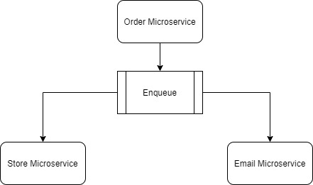

# Nodejs Microservices

### Install Requirements
```
* [Npm](https://www.npmjs.com/)
* [Mongo Db](https://www.mongodb.com/es) 
* note : change ".env.example" by ".env" and use your data

```

### Usage
#### Use the following commands to work with this project
```
1- Run: npm start
2- Install: npm install
3- Dev:  npm run dev
 
```
## Built with

* [RabbitMQ](https://www.rabbitmq.com/) 
* [CloudAMQP](https://www.cloudamqp.com/) 
* [Mongoose](https://mongoosejs.com) 
* [Express](https://expressjs.com/es/) - [Licence]( https://creativecommons.org/licenses/by-sa/3.0/us/)
* [NodeMon](https://nodemon.io/) - [Licence](http://rem.mit-license.org) 
* [Swagger](https://www.npmjs.com/package/swagger-ui-express)  
* [Body-parser](https://www.npmjs.com/package/body-parser) 
* [Cors](https://www.npmjs.com/package/cors) 
* [Dotenv](https://www.npmjs.com/package/dotenv)  
* [Eslint](https://www.npmjs.com/package/eslint) 


### Useful Diagram




Enjoy it ;)